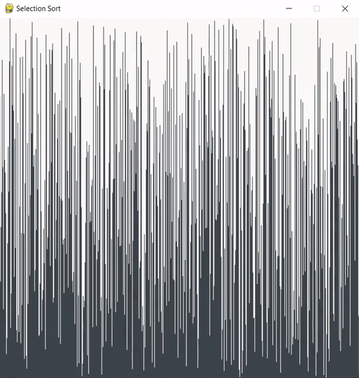
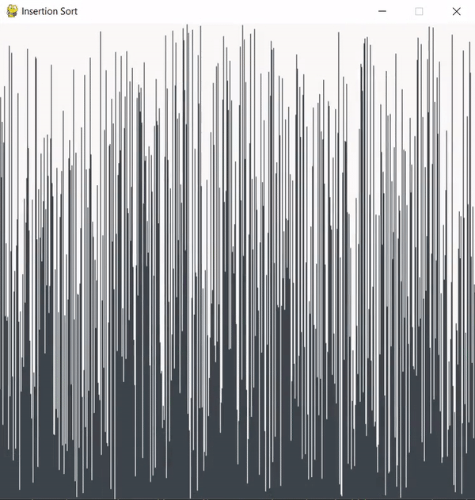
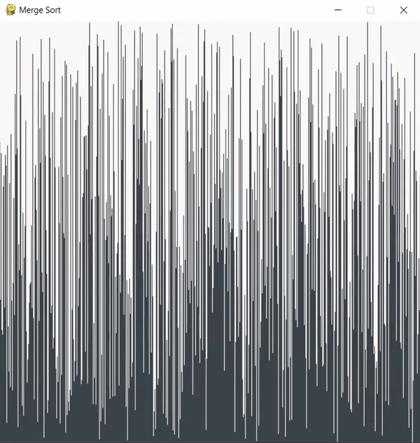

# Sorting Visualizer

## What is this?

Just a simple visualizer for some of the most common data sorting algorithms. Each algorithm takes in a randomized list of unique numbers, in the range 0 to 599, and sorts them. Each number in the list represents the height of a rectangle in the visualizer window. As the sorting algorithm sorts the randomized list the visualizer redraws each rectangle to show how it moves around during the sorting process. Note, these visualizations are not perfect as some algorithms, such as bubble sort, would take a very long time to show every individual step in the sorting process. Visualization was done using the pygame module for Python.

## Output examples

